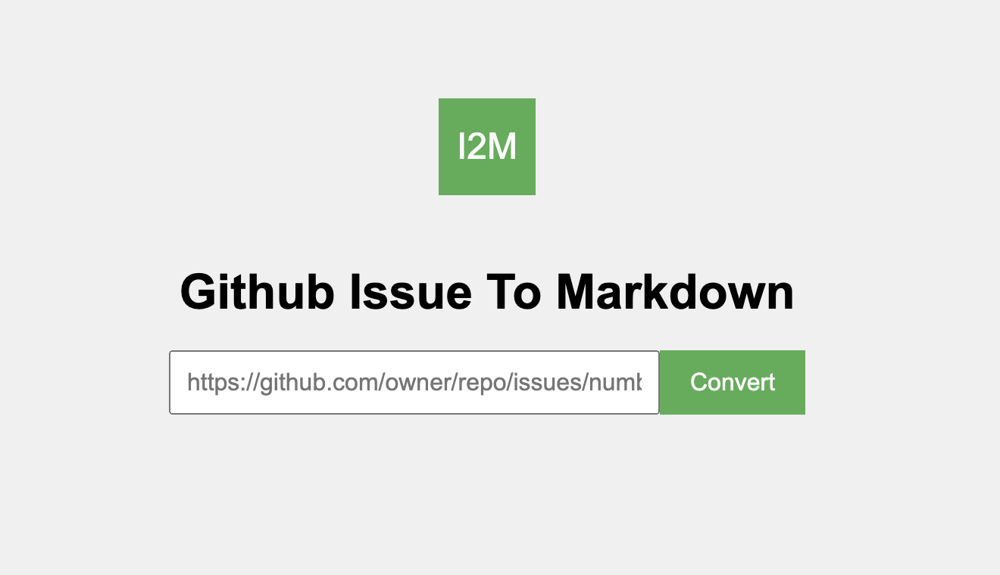

# issue2md

一个命令行和网页工具，用于将GitHub issue转换为Markdown格式文件。

>此仓库中的大部分内容是由人工智能生成的!

## 命令行模式

### 安装issue2md命令行工具

```
$ go install github.com/bigwhite/issue2md/cmd/issue2md@latest
```

### 将issue转换为Markdown

```
用法：issue2md issue-url [markdown-file]
参数：
  issue-url      要转换的GitHub issue的URL。
  markdown-file  （可选）输出的Markdown文件。
```

## 网页模式

### 安装并运行 issue2md web

```
$ git clone https://github.com/bigwhite/issue2md.git
$ make web
$ ./issue2mdweb   
服务器正在运行在 http://0.0.0.0:8080
```

### 将问题转换为 Markdown

在浏览器中打开 localhost:8080：



输入您想要转换的问题URL，然后点击“Convert”按钮！
